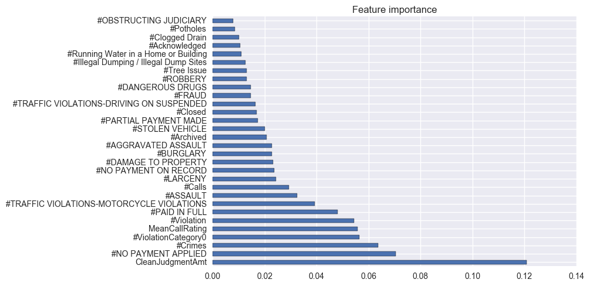
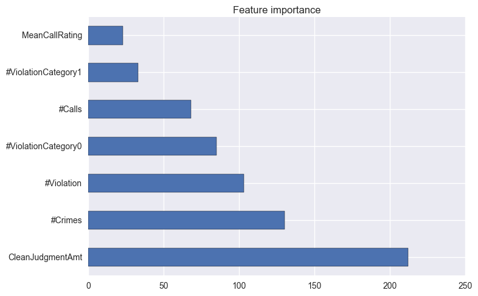
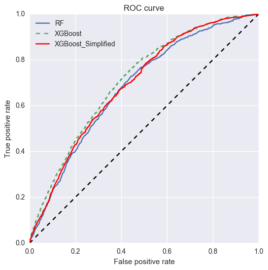

# Data Science at Scale: Capstone Project

#### Submitted by: Sumit Binnani <sumit.binnani@gmail.com>

The jupyter notebooks for the code is available in the github repository mentioned in the following link. 
**Link**: <https://github.com/sumitbinnani/DataScienceAtScaleCapstoneProject> 
**DataSource**: <https://github.com/uwescience/datasci_course_materials/tree/master/capstone/blight>

## Pre-processing

1. Extract Latitude/Longitude from the provided files
2. Remove records falling outside the range of detroit city
3. The building ids were assigned by dividing the detroit region using Geohashes (<https://en.wikipedia.org/wiki/Geohash>)
4. Extract features for each geohashes in the dataset (feature details in next section)

I also tried assigning building address using Google's reverse geocoding api (<https://developers.google.com/maps/documentation/geocoding/intro>). I, however, ran out of my quota for api calls, and wasn't able to generate building ids for the complete data in given time frame.

## Model

### Features Used

I used following features for given building:
    1. Count of Violations,
    2. Count of Crimes,
    3. Count of Calls,
    4. Count of Violation Category (0 and 1),
    5. Count for violation's payments: made/not made/partially made,
    6. Count of types of crime reported,
    7. Count of open, closed, acknowleged, and archived tickets, etc.

### Feature Importance obtained using Random Forest

The top 30 feature importance as returned by Random Forest Classifier with 500 trees is as shown in the following image:  

### Final Model: Simplified XGBoost with selected a Features

The final model was trained with a selected few features and tree depth restrcited to 4. Restricting tree size not only makes the model easy to interpret, but also makes it immune to overfitting. The features to train the final model were:
* Count of Violations, 311 Calls, and Crimes
* Count of Violation Category, Call Rating

**The AUC of final model is 0.692**. It can be seen that the AUC of the final model and AUC of Model trained with all the derived features (0.710) is comparable. with feature importance as   

### ROC Curve for all the models

ROC curve for all the models:
    1. Random Forest with 500 trees
    2. XGBoost with all the features
    3. XGboost with a selected few features
    

## How can the model be improved?

* Generated building ids based on Reverse-GeoCoding Services.
* Using time based feature along with some decay factor on basis of time date and time when the builing was blighted.

## Thanks!
